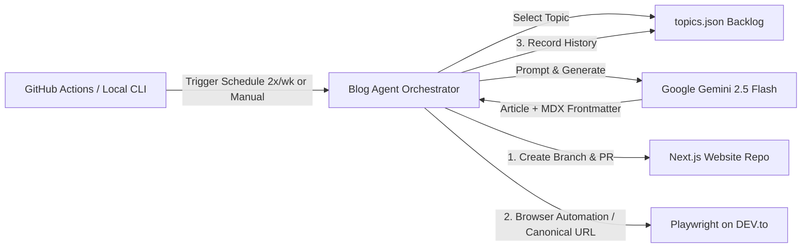

# 🚀 Automated Blog Publishing Workflow Agent

An autonomous technical blog publishing agent written in **TypeScript**. Powered by **Google Gemini**, this workflow generates in-depth technical articles on a scheduled cadence (2 days a week) or on-demand, opens a Pull Request on your target **Next.js website repository**, and automatically cross-posts to **DEV.to** with **canonical URLs** for guaranteed search engine attribution.

---

## 🌟 Key Features

- 🤖 **AI Content Generation**: Generates 800–1200+ word technical deep-dives with production-ready code blocks and formatted frontmatter using Google Gemini (`gemini-2.5-flash`).
- 🔄 **Next.js Website Integration**: Opens a new branch and Pull Request on your target Next.js repository with properly formatted MDX/Markdown.
- 🎭 **Playwright Browser Automation**: Automates DEV.to publishing through real browser interactions (`dev.to/new`), filling the editor, title, tags, and automatically setting the canonical URL in settings.
- 🎯 **Canonical URL Attribution**: Injects your website's canonical URL into DEV.to (`canonical_url`), ensuring search engines attribute 100% of domain authority and SEO to your personal domain.
- ⏰ **Scheduled 2x/Week Cadence**: GitHub Actions workflow runs every **Tuesday** and **Friday** at 13:00 UTC (18:30 IST) or on-demand with `workflow_dispatch`.
- 🔑 **Interactive Login Helper**: Run `npm run devto:login` once to open a browser, log in, and persist `.auth/devto-session.json` for seamless headless execution.
- 📋 **Managed Backlog**: Keeps a curated queue of high-impact topics in `src/topics.json` and records published history so topics are never repeated.
- 🧪 **Zero-Risk Dry Runs**: Complete dry-run mode (`--dry-run`) allowing you to simulate the entire pipeline without publishing or modifying external repositories.

---

## 🏗️ Architecture



---

## 🛠️ GitHub Actions Setup

To enable the automated 2x/week schedule, add the following secrets in your GitHub repository:
**Settings** → **Secrets and variables** → **Actions** → **New repository secret**:

| Secret Name | Description | Example / Source |
|---|---|---|
| `GEMINI_API_KEY` | Google Gemini API Key | [Google AI Studio](https://aistudio.google.com/) |
| `TARGET_REPO_PAT` | GitHub Personal Access Token (PAT) with `repo` permissions | [GitHub PAT Settings](https://github.com/settings/tokens) |
| `DEVTO_API_KEY` | DEV.to API Key | [DEV.to Extensions Settings](https://dev.to/settings/extensions) |
| `TARGET_REPO_OWNER` | GitHub username/org of your Next.js site | `mohitjoer` |
| `TARGET_REPO_NAME` | Repository name of your Next.js site | `mohitjoe` |
| `TARGET_SITE_URL` | Public production domain of your Next.js site | `https://mohitjoe.com` |

### Optional Variables / Secrets:
- `TARGET_BLOG_DIR`: Directory in the Next.js repo where posts live (Default: `content/posts`)
- `TARGET_FILE_EXT`: Extension (`mdx` or `md`, Default: `mdx`)
- `BLOG_PATH_PREFIX`: Path prefix for blog URLs (Default: `/blog`)
- `TARGET_BASE_BRANCH`: Base branch to target for PRs (Default: `main`)
- `DEVTO_PUBLISH_AS_DRAFT`: Set to `true` if you want DEV.to posts saved as drafts first (Default: `false`)

---

## 💻 Local Quickstart

### 1. Install Dependencies
```bash
npm install
```

### 2. Configure Environment
Copy `.env.example` to `.env` and fill in your keys:
```bash
cp .env.example .env
```

### 3. Run in Dry-Run Mode
Test the workflow without committing or publishing:
```bash
npm run dry-run
```

### 4. Run Live
Run live publishing for the next topic in queue:
```bash
npm start
```

Or publish with a custom topic:
```bash
npx tsx src/index.ts --topic "Building Scalable Real-time Apps with WebSockets and Node.js"
```

---

## 📁 Repository Structure

```
blog_agent/
├── .github/
│   └── workflows/
│       └── blog-poster.yml     # Scheduled cron (2x/week) and dispatch workflow
├── src/
│   ├── config.ts               # Environment validation (Zod)
│   ├── generator.ts            # Google Gemini technical article generator
│   ├── github.ts               # GitHub Octokit PR creator for Next.js repo
│   ├── devto.ts                # DEV.to publishing client with canonical URL
│   ├── topics.json             # Curated topics backlog and published history
│   └── index.ts                # Main workflow runner
├── .env.example                # Example environment variables
├── package.json                # Project dependencies and scripts
└── tsconfig.json               # TypeScript configuration
```

---

## 🎯 Canonical URL Verification

When the agent publishes an article to DEV.to, it sets:
```json
{
  "article": {
    "title": "...",
    "canonical_url": "https://mohitjoe.com/blog/my-article-slug",
    "published": true
  }
}
```
This tells search engines like Google that **your website** is the original author and primary source of truth, routing search ranking authority directly to your domain!
