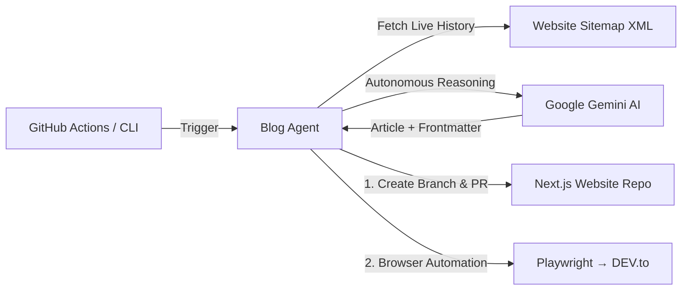

# 🚀 Autonomous Blog Publishing Agent

An autonomous AI-powered blog publishing agent built in **TypeScript**. Powered by **Google Gemini**, this agent **thinks, reasons, and autonomously generates** original technical blog posts — no hardcoded topic queue needed. It opens Pull Requests on your target **Next.js website repository** and cross-posts to **DEV.to** with **canonical URLs** for search engine attribution.

---

## 🌟 Key Features

- 🧠 **Autonomous Topic Reasoning**: Uses AI to analyze your existing published content, identify content gaps, and brainstorm original topics — no static queue or manual topic lists needed.
- 🤖 **AI Content Generation**: Generates 800–1200+ word technical deep-dives with production-ready code blocks and formatted frontmatter using Google Gemini.
- 🔄 **Next.js Website Integration**: Creates a branch and Pull Request on your target Next.js repository with properly formatted MDX/Markdown.
- 🎭 **Playwright Browser Automation**: Automates DEV.to publishing through real browser interactions, filling the editor, title, tags, and setting the canonical URL.
- 🎯 **Canonical URL Attribution**: Sets your website's canonical URL on DEV.to so search engines attribute 100% of domain authority to your personal domain.
- 📡 **Live Sitemap Sync**: Automatically fetches your website's `sitemap.xml` to track all published posts and prevent duplicate content.
- ⏰ **Scheduled Cadence**: GitHub Actions workflow runs every **Monday** and **Thursday** at 13:00 UTC, or on-demand with `workflow_dispatch`.
- 🔑 **Interactive Login Helper**: Run `npm run devto:login` once to persist `.auth/devto-session.json` for seamless headless execution.
- 🧪 **Zero-Risk Dry Runs**: Simulate the entire pipeline without publishing or modifying external repositories (`--dry-run`).

---

## 🏗️ Architecture



---

## 🛠️ GitHub Actions Setup

Add the following **Secrets** in your repository: **Settings** → **Secrets and variables** → **Actions** → **New repository secret**:

| Secret Name | Description | Source |
|---|---|---|
| `GEMINI_API_KEY` | Google Gemini API Key | [Google AI Studio](https://aistudio.google.com/) |
| `TARGET_REPO_PAT` | GitHub PAT with `repo` permissions | [GitHub PAT Settings](https://github.com/settings/tokens) |
| `TARGET_REPO_OWNER` | GitHub username/org of your website repo | Your GitHub username |
| `TARGET_REPO_NAME` | Repository name of your website | Your repo name |
| `TARGET_SITE_URL` | Public production URL of your website | `https://your-domain.com` |
| `DEVTO_EMAIL` | DEV.to account email (for Playwright login) | Your DEV.to email |
| `DEVTO_PASSWORD` | DEV.to account password | Your DEV.to password |

### Optional Variables:
- `TARGET_BLOG_DIR`: Directory where posts live (Default: `content/posts`)
- `TARGET_FILE_EXT`: Extension `mdx` or `md` (Default: `mdx`)
- `BLOG_PATH_PREFIX`: URL path prefix for blog (Default: `/blog`)
- `TARGET_BASE_BRANCH`: Base branch for PRs (Default: `main`)
- `TARGET_BLOG_BRANCH`: Branch name for blog PRs (Default: `blog_branch`)
- `DEVTO_PUBLISH_AS_DRAFT`: Set to `true` for DEV.to drafts (Default: `false`)
- `DEVTO_API_KEY`: DEV.to API Key (if using `PUBLISH_METHOD=api`)

---

## 💻 Local Quickstart

### 1. Install Dependencies
```bash
npm install
npx playwright install --with-deps chromium
```

### 2. Configure Environment
```bash
cp .env.example .env
# Edit .env with your API keys, repo settings, and DEV.to credentials
```

### 3. Cache DEV.to Session (One-time)
```bash
npm run devto:login
```

### 4. Dry Run (Safe Test)
```bash
npm run dry-run
```

### 5. Run Live
```bash
npm start
```

Or with a specific topic:
```bash
npx tsx src/index.ts --topic "Your Custom Blog Topic Here"
```

### 6. Sync History from Sitemap
```bash
npm run sync:sitemap
```

---

## 📁 Repository Structure

```
blog_agent/
├── .github/
│   └── workflows/
│       └── blog-poster.yml       # Scheduled cron workflow (Mon & Thu)
├── src/
│   ├── config.ts                 # Zod-validated environment config
│   ├── generator.ts              # Google Gemini autonomous article generator
│   ├── github.ts                 # GitHub Octokit PR creator
│   ├── devto-playwright.ts       # Playwright DEV.to browser automation
│   ├── devto.ts                  # DEV.to REST API fallback
│   ├── sitemap.ts                # Sitemap XML parser & inspector
│   ├── login-helper.ts           # Interactive DEV.to login helper
│   └── index.ts                  # Main workflow orchestrator
├── .env.example                  # Example environment variables
├── LICENSE                       # MIT License
├── package.json
└── tsconfig.json
```

---

## 🎯 How Autonomous Reasoning Works

Unlike traditional scheduled blog bots that pull from a hardcoded queue, this agent:

1. **Syncs** your live website sitemap to know every article already published.
2. **Analyzes** the full publishing history (titles, slugs, topics covered).
3. **Reasons** about content gaps across your project's technical pillars.
4. **Generates** an original, non-duplicate article targeting an uncovered angle.
5. **Publishes** to your website (via PR) and cross-posts to DEV.to with canonical attribution.

---

## 🎯 Canonical URL Verification

When the agent publishes to DEV.to, it sets:
```html
<link rel="canonical" href="https://your-domain.com/blog/your-article-slug" />
```
This ensures search engines attribute authority to **your website**, not DEV.to.

---

## 📄 License

MIT
